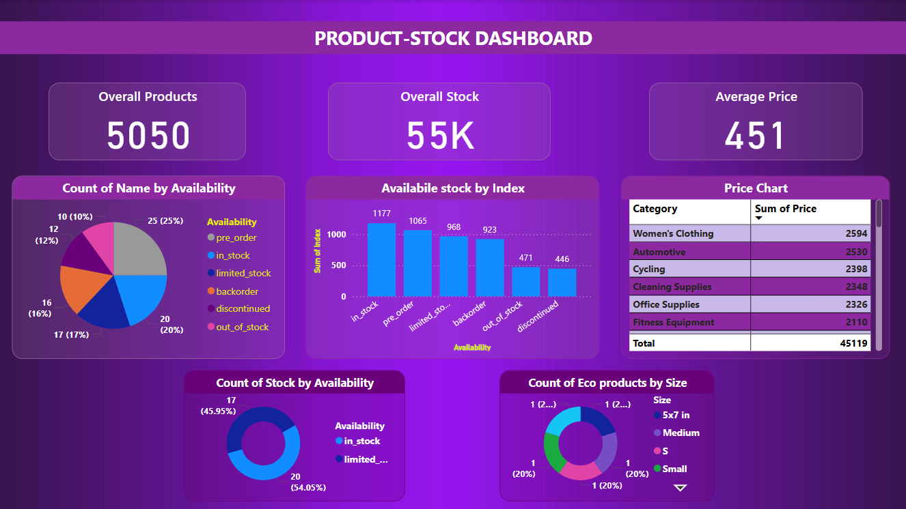

# 📊 Product Stock Dashboard - Power BI

This repository contains a Power BI dashboard project that visualizes product stock data. It was created using a dataset of 100 product records and provides an overview of 
product availability, stock levels, price analysis, and eco-friendly product distribution.

## 📝 Project Overview

This is my **first Power BI dashboard**, created as part of my learning journey in data analytics and visualization. 
The dashboard offers a clear and interactive representation of the product stock, helping to understand availability, pricing trends, and category breakdowns.

## 📌 Key Features

**Overall Metrics**: Displays total number of products, overall stock, and average price.
**Product Availability**: Pie and donut charts to show the distribution of products by availability status.
**Stock by Availability**: Bar chart comparing available stock across different availability types.
**Price Chart**: Category-wise price comparison.
**Eco Product Insights**: Size-wise distribution of eco-friendly products.
  
## 📷 Dashboard Preview

## 📁 Dataset

- Sample dataset includes **100 product records**
- Fields used: `Product Name`, `Availability`, `Price`, `Category`, `Stock`, `Size`, `Eco status`

## 🚀 Tools Used

**Microsoft Power BI**
**Power Query (Data Transformation)**
**Custom Visualizations**

## 🎯 What I Learned

- Building interactive dashboards in Power BI
- Applying filters and slicers
- Using DAX functions for calculations
- Visual storytelling with business data

## 📌 Future Improvements

- Adding date filters for time-series trends
- Creating drill-through pages
- Enhancing interactivity with tooltips

